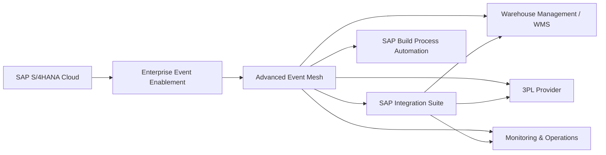

# Solution Architecture

## 1. Target Architecture



## 2. Architectural Roles

### SAP S/4HANA Cloud
System of record for the business process. It produces relevant business events.

### Enterprise Event Enablement
Provides the mechanism for exposing supported SAP business events.

### Advanced Event Mesh
Acts as the event distribution backbone and decouples publishers from consumers.

### SAP Integration Suite
Provides integration capabilities where mediation, transformation, routing or protocol handling is required.

### Downstream Consumers
Warehouse applications, 3PL systems and process automation can subscribe independently.

## 3. Why the Architecture Is Event-Driven

A producer should not need to maintain a separate synchronous integration for every consumer.

With pub/sub:

```text
                 +--> Consumer A
                 |
Producer --> Event Backbone --> Consumer B
                 |
                 +--> Consumer C
```

A new consumer can be introduced without redesigning the producer integration.

## 4. Architectural Quality Attributes

| Attribute | Design Response |
|---|---|
| Scalability | Event broker separates producer and consumer load |
| Extensibility | New subscribers can be added independently |
| Resilience | Retry and dead-letter concepts are defined at consumer/integration level |
| Maintainability | Integration responsibilities are separated |
| Security | Least privilege and controlled connectivity |
| Observability | Technical and business correlation identifiers |
| Evolvability | Versioned event contracts |

## 5. Architecture Boundary

The diagram represents a target architecture rather than evidence of a deployed production landscape. Concrete SAP tenant configuration must be validated during implementation.
